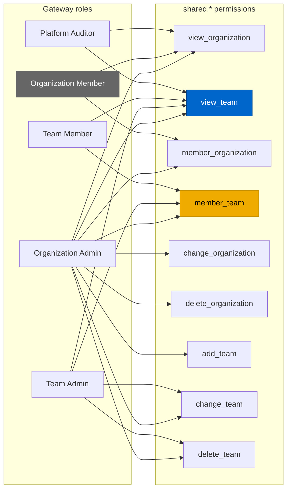
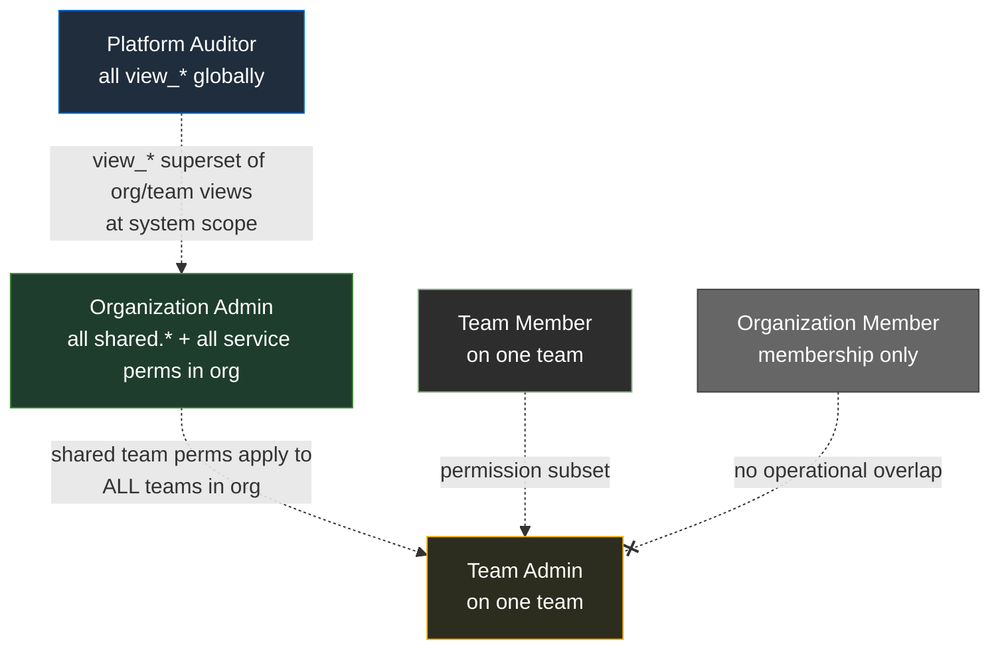
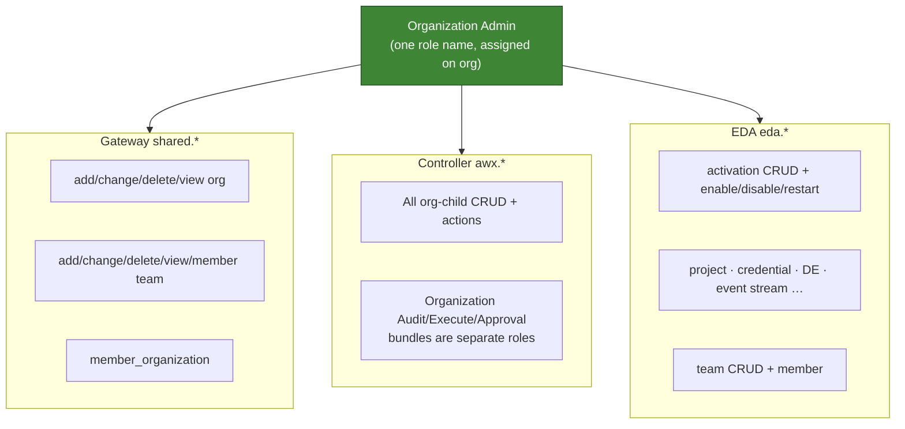
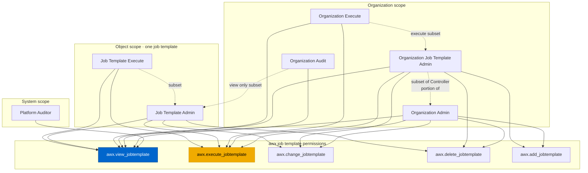
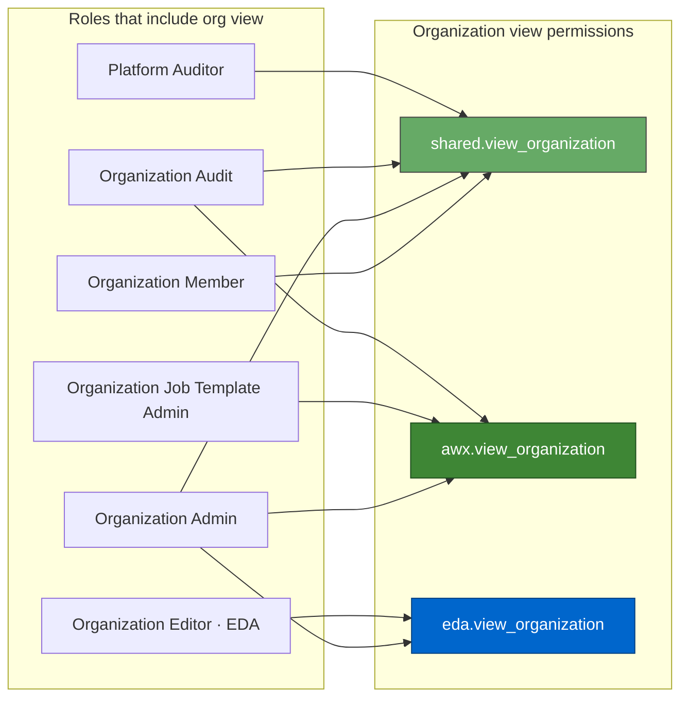
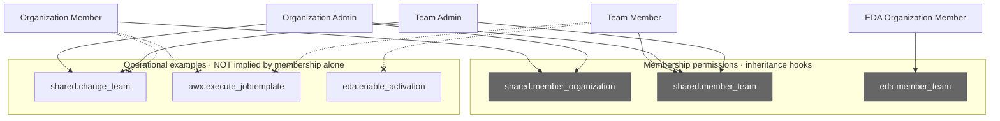
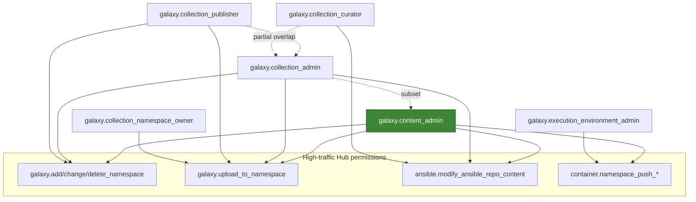

# AAP RBAC — Role & Permission Overlaps

Advanced diagrams showing **where managed roles share permissions**, **where one role’s permissions are a subset of another’s**, and **where the same role name merges permission sets across services**.

**Prerequisites:** [AAP-RBAC-MANAGED-ROLES-CATALOG.md](./AAP-RBAC-MANAGED-ROLES-CATALOG.md) (exact permission lists)

**Related:** [AAP-RBAC-ROLE-HIERARCHY.md](./AAP-RBAC-ROLE-HIERARCHY.md) · [AAP-RBAC-GUIDE.md](./AAP-RBAC-GUIDE.md)

---

## How to read these diagrams

AAP RBAC overlap is **not** role inheritance (assigning Org Admin does not auto-assign Team Admin). Overlap appears in three different ways:

| Overlap type | Meaning | Example |
|--------------|---------|---------|
| **Shared permission** | Same permission slug appears in multiple roles | `shared.member_team` in Team Member, Team Admin, and Organization Admin |
| **Permission subset** | Role A’s permissions are entirely contained in Role B’s (same or wider scope) | Team Member ⊆ Team Admin on a team |
| **Union / merge** | Same role **name** combines permission sets from multiple services | Organization Admin = Gateway `shared.*` + Controller `awx.*` + EDA `eda.*` |
| **View overlap** | Many roles include `view_*` on the same resource | `awx.view_jobtemplate` in Execute, Admin, Org Execute, Org Audit, Platform Auditor |

**Line styles in diagrams:**

- **Solid arrow** → role **includes** that permission
- **Dashed arrow** → role A’s permission set is a **subset of** role B (when scopes align)
- **Thick hub node** → permission shared by **3+** roles

---

## Diagram 1 — Gateway shared permissions (bipartite map)

Roles on the left, permissions on the right. Follow lines to see **who shares what**.



**Highlights:**

- **`shared.member_team`** (gold) — shared by Team Member, Team Admin, Organization Admin; **not** in Organization Member alone for team ops at org scope the same way (Org Admin has it on all teams in org).
- **`shared.view_team`** (blue) — widest view overlap: Platform Auditor sees all teams; org/team roles see within assignment scope.
- **Organization Member** — only touches `member_organization` + `view_organization`; **no overlap** with operational team permissions.

---

## Diagram 2 — Gateway role subset relationships

When assigned on **compatible objects**, permission sets nest like this:



**Team Member ⊆ Team Admin** (same team object):

| Permission | Team Member | Team Admin |
|------------|:-----------:|:----------:|
| `shared.view_team` | ✓ | ✓ |
| `shared.member_team` | ✓ | ✓ |
| `shared.change_team` | | ✓ |
| `shared.delete_team` | | ✓ |

**Organization Admin ⊃ Team Admin** for shared team permissions — but on **different assignment scope** (org vs team). Org Admin’s team permissions apply to **every team in the org**, not one team.

---

## Diagram 3 — Organization Admin: merged permission unions

Same role **name**, three permission sources in unified Platform:



**Overlap consequence:** A user with **Organization Admin** already has permissions that **overlap** with:

- **Team Admin** (shared team permissions, org-wide)
- **Organization {Resource} Admin** for every Controller/EDA resource type
- **Organization Execute**, **Organization Audit** (as subsets — Org Admin is strictly broader)

You rarely need Org Admin **plus** Organization Project Admin — the latter is a **subset** of Org Admin’s Controller portion.

---

## Diagram 4 — Controller: Job Template permission overlap

One resource type; many roles reuse the same permission slugs on **different scopes**.



**Patterns that repeat** for Inventory, Project, Credential, Workflow, etc.:

| Pattern | Subset relationship |
|---------|---------------------|
| `{Resource} {Action}` ⊆ `{Resource} Admin` | Execute ⊆ Admin on same object |
| `Organization Execute` ⊆ `Organization Admin` | Runnable subset only |
| `Organization Audit` ⊆ `Organization Admin` | View subset only |
| `Organization {Resource} Admin` ⊆ `Organization Admin` | Single-type admin ⊆ full org admin |
| `Platform Auditor` | View permissions only; overlaps **view** portions of all roles above |

---

## Diagram 5 — Cross-service “view” overlap on organizations

Three services define **view organization** separately — roles can overlap without sharing the same slug:



**Takeaway:** “Can view the organization” may require **multiple slugs** depending on which UI/API you hit. Organization Member only has `shared.*`; Organization Admin accumulates all three services’ org-view permissions.

---

## Diagram 6 — Membership permissions vs operational permissions

Membership slugs overlap roles but **do not** grant the same capabilities:



**Organization Member** and **Team Member** share **membership-class** permissions with admin roles but **lack** operational permissions (dashed X = no overlap with ops).

---

## Diagram 7 — Hub: global role permission overlap

Several `galaxy.*` roles share namespace and collection permissions:



**galaxy.content_admin** is the **superset** for collection/namespace/EE permissions among global Hub roles.

---

## Overlap matrix — Gateway shared permissions

Which roles include each permission? ✓ = included.

| Permission | Platform Auditor | Org Admin | Org Member | Team Admin | Team Member |
|------------|:----------------:|:---------:|:----------:|:----------:|:-----------:|
| `shared.view_organization` | ✓ | ✓ | ✓ | | |
| `shared.view_team` | ✓ | ✓ | | ✓ | ✓ |
| `shared.member_organization` | | ✓ | ✓ | | |
| `shared.member_team` | | ✓ | | ✓ | ✓ |
| `shared.change_organization` | | ✓ | | | |
| `shared.delete_organization` | | ✓ | | | |
| `shared.add_team` | | ✓ | | | |
| `shared.change_team` | | ✓ | | ✓ | |
| `shared.delete_team` | | ✓ | | ✓ | |

---

## Overlap matrix — Controller job template (sample)

| Permission | JT Execute | JT Admin | Org Execute | Org JT Admin | Org Admin | Org Audit | Platform Auditor |
|------------|:----------:|:--------:|:-----------:|:------------:|:---------:|:---------:|:----------------:|
| `view_jobtemplate` | ✓ | ✓ | ✓ | ✓ | ✓ | ✓ | ✓ |
| `execute_jobtemplate` | ✓ | ✓ | ✓ | ✓ | ✓ | | |
| `change_jobtemplate` | | ✓ | | ✓ | ✓ | | |
| `delete_jobtemplate` | | ✓ | | ✓ | ✓ | | |
| `add_jobtemplate` | | | | ✓ | ✓ | | |

---

## Practical implications

### Avoid redundant assignments

| Already has | Usually redundant to also assign |
|-------------|----------------------------------|
| Organization Admin | Organization {Resource} Admin, Team Admin (for team mgmt in that org), Organization Execute/Audit |
| Job Template Admin | Job Template Execute (on same template) |
| Team Admin | Team Member (on same team — Admin is strict superset) |
| galaxy.content_admin | galaxy.collection_admin, galaxy.collection_publisher |

### Overlap does not mean inheritance

Two users both needing `awx.execute_jobtemplate` on **different** job templates need **separate** assignments (or a team/org role that covers both). Shared permission slugs do not automatically flow between objects.

### Organization Member is an overlap outlier

It shares **`member_organization`** with Organization Admin but **nothing operational** — always show it separately in overlap analysis (see Diagram 6).

---

## Source & maintenance

Derived from [AAP-RBAC-MANAGED-ROLES-CATALOG.md](./AAP-RBAC-MANAGED-ROLES-CATALOG.md). Re-validate after AAP upgrades:

```http
GET /api/gateway/v1/role_definitions/?managed=true
```

Compare `permissions` arrays on roles that should nest as subsets.
